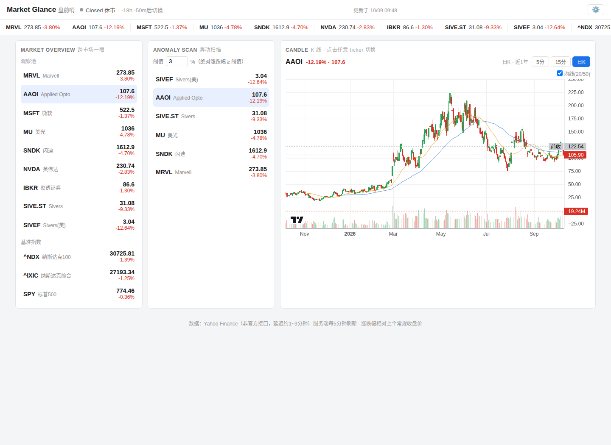

# Market Glance 美股行情看板

个人美股行情看板，覆盖常规交易时段及盘前、盘后行情：查看观察池、异动扫描、K 线和跨市场参考。休市、隔夜、周末和假日继续显示最近完整交易日的收盘涨跌幅；若有盘前或盘后价格，会单独标注，并显示相对最近常规收盘价的变化。桌面端为“观察池—中央图表—异动”三栏；平板端优先展示观察池与图表，异动栏可收起；手机端可在观察池、异动和图表间切换。观察池支持按代码、名称或分组搜索，以及按代码或涨跌幅排序；异动榜可按全部、涨幅或跌幅筛选。顶部行情带按观察池配置顺序显示全部代码，可直接点击切换图表。



> 截图展示深色模式、收盘涨跌幅与盘后价格的区分；报价为界面演示样例，不代表实时行情。

## 功能与架构

```text
行情源（每只代码自动路由，也可手动选择 Alpaca IEX 或 Yahoo Finance）
    │
fetch.py ── 读取 config.json 的数据源与抓取间隔 ──→ data/quotes.json + data/klines/*.json
    │                                             ↑
    └── systemd timer 每分钟检查一次；未到配置间隔时不访问行情源
                                                  │
server.py ── 页面服务 + /api/config + /api/klines + /api/market-status
    │
index.html ── 同源单页看板（lightweight-charts 内联，无外部运行时依赖）
    │
macOS WidgetKit ── 只读 127.0.0.1:<配置端口>/data/quotes.json
```

- **K 线**：提供日K和当日走势（5 分钟粒度）；当日走势只显示最近一个有数据的交易日，周末、休市时显示上一交易日并标注日期。Yahoo 分钟线请求包含盘前盘后数据；图表会统计并标出当天实际收到的盘前 K 线。换标或切换周期时先清除旧图；新代码加载失败不会残留上一只股票的 K 线。过期请求不会覆盖后来选中的标的。
- **市场状态**：按纽约当地时间识别周末、NYSE 常规假日、盘前/盘中/盘后和常见提前收市日，每 30 秒更新一次并显示纽约时间；倒计时指向下一个真实时段。市场状态与行情快照的最后更新时间分开展示。特殊临时休市不在年度规则表内。
- **涨跌幅口径**：盘中按实时成交价相对最近常规收盘价计算；盘前、盘后及休市时按最近完整交易日收盘价对前一交易日收盘价计算。扩展时段价格及其相对常规收盘的变化会单独标注。
- **主题与布局**：可在页面顶部选择浅色、深色或系统模式；主题和桌面面板显示偏好自动保存在当前浏览器。
- **安全渲染**：可编辑分组名和显示名通过 DOM 文本/表单属性渲染，不拼接到 HTML。
- **失败回退**：抓取失败时保留最后成功行情并标记旧数据。
- **数据源**：每只代码可选择自动、Alpaca IEX 或 Yahoo Finance。自动模式将普通美股代码路由到 Alpaca IEX，将指数和带市场后缀的代码路由到 Yahoo Finance；手动来源对该代码的报价、前收、涨跌与 K 线统一生效，失败时不会跨源回退。Alpaca IEX 只含 IEX 单一交易所的成交，并非 SIP 全市场汇总。

## 安装

### macOS（轻量运行）

无需 Electron；使用 macOS 自带的 `launchd` 启动本机服务，再用默认浏览器打开看板。需要 Python 3.9+；不需要管理员权限。

```bash
git clone https://github.com/longyunBegin/market-glance.git
cd market-glance
bash macos/install.sh
```

安装脚本将应用复制到 `~/Library/Application Support/Market Glance`，创建两个当前用户的 LaunchAgent（网页服务常驻；抓取任务每分钟唤醒，并遵守配置的抓取间隔），然后打开本机看板。现有本地配置会保留；首次安装时使用仓库内的 `config.json`（若有），否则采用示例配置。设置、行情缓存和日志都保存在上述目录。运行 `bash macos/uninstall.sh` 可停止并移除自动启动项；为避免误删数据，本地设置、缓存和日志会保留。

**原生 macOS 行情小组件（macOS 14+）**：安装时若检测到 Xcode，脚本会构建并安装 `~/Applications/Market Glance.app`，使用小组件图库添加“Market Glance 行情”，支持小号与中号布局。小组件使用大号现价、涨跌幅和横向观察代码列表；深色外观为纯黑，浅色外观跟随 macOS 系统外观。数据只从本机看板服务读取，不读取钥匙串或访问行情源；其更新时间由 WidgetKit 系统计划管理，非实时推送。若安装时没有 Xcode，可之后安装 Xcode 并运行 `bash ~/Library/Application\ Support/Market\ Glance/macos/install-widget.sh <端口>`；端口应与 `config.json` 中的 `www_port` 相同。网页内已有主题偏好不受小组件影响。

**Chrome 工具栏快看（最小版）**：安装后在 Chrome 打开 `chrome://extensions`，启用“开发者模式”，点击“加载已解压的扩展程序”，选择 `~/Library/Application Support/Market Glance/app/chrome-extension`。之后点击工具栏中的 Market Glance 图标即可查看本机观察池行情；弹窗只读取本机行情快照，不接触钥匙串密钥。扩展使用安装时配置的服务端口。

Alpaca IEX 密钥不写入配置或仓库。若要启用，请在 macOS“钥匙串访问”中将两个值分别保存为登录钥匙串的通用密码，账户填 macOS 短用户名，服务名分别为 `Market Glance Alpaca Key ID` 和 `Market Glance Alpaca Secret Key`；服务运行时从钥匙串读取。没有密钥时，使用 Yahoo Finance 的代码仍可用；自动路由至 Alpaca IEX 的普通美股代码需要密钥。

### Linux（systemd）

需要 Linux、Python 3.9+ 和 systemd，无第三方 Python 依赖。建议将仓库放在不含空格的目录中；安装脚本会从当前仓库目录生成 systemd 单元，不依赖某个固定用户或路径。

```bash
git clone https://github.com/longyunBegin/market-glance.git
cd market-glance
cp config.example.json config.json
# 按需编辑 config.json
sudo bash systemd/install.sh
```

默认网页服务只监听 `127.0.0.1`，可在本机打开 `http://127.0.0.1:8090`。需要从另一台机器访问时，建议配置 SSH 隧道；如需直接暴露网络端口，应自行配置防火墙和访问控制。

### 从旧版升级

旧提交曾将 `config.json` 纳入 Git。升级到忽略本地配置的版本前，先在仓库目录备份并从工作区恢复旧的跟踪版本，避免本地观察列表阻止 `git pull` 或被删除：

```bash
backup="../market-glance-config.$(date +%Y%m%d%H%M%S).json"
cp config.json "$backup"
git checkout -- config.json
git pull
cp "$backup" config.json
sudo bash systemd/install.sh
```

### 可选 SSH 隧道

安装脚本默认不会启用隧道。需要隧道时，先在系统本机配置命令：

```bash
sudo install -m 600 /dev/null /etc/default/market-glance-tunnel
sudoedit /etc/default/market-glance-tunnel
```

文件内容示例（把地址和参数改成自己的环境）：

```ini
TUNNEL_CMD="ssh -N -T -o ServerAliveInterval=30 -o ServerAliveCountMax=3 -o ExitOnForwardFailure=yes -R 8090:localhost:8090 user@your-host"
```

之后执行 `sudo ENABLE_TUNNEL=1 bash systemd/install.sh`。隧道断开后脚本会重试；不再需要时可运行 `sudo systemctl disable --now market-glance-tunnel.service`。

## 配置

`config.json` 是每台机器自己的配置，已加入 Git 忽略规则；仓库只保存 `config.example.json`。可在观察池标题旁点“新增”编辑分组、代码和每只代码的数据源；保存前会校验并预览差异。右上角齿轮用于调整异动阈值和抓取间隔。行情列表会标出本轮实际来源；观察池保存后页面会显示更新状态，直到新行情快照到达。

```json
{
  "anomaly_threshold_pct": 3.0,
  "fetch_interval_secs": 300,
  "www_port": 8090,
  "groups": [
    {"name": "观察池", "tickers": [{"name": "显示名", "symbol": "AAPL", "provider_mode": "auto"}]}
  ]
}
```

- `anomaly_threshold_pct`：异动区阈值，范围 `0.1`～`50`。
- `provider_mode`：逐代码来源模式，可选 `auto`、`alpaca_iex` 或 `yahoo`；省略时默认为 `auto`。自动模式将普通字母/数字美股代码（如 `AAPL`）路由到 Alpaca IEX，将指数（如 `^NDX`）及带后缀代码（如 `SIVE.ST`）路由到 Yahoo Finance。旧配置中自动生成的来源不会覆盖自动模式；旧的全局 `market_data_provider` 字段会被忽略。
- `fetch_interval_secs`：实际行情抓取间隔，范围 `60`～`86400` 秒；timer 每分钟唤醒一次，脚本依据该值决定是否访问行情源。
- `www_port`：网页服务端口，范围 `1024`～`65535`。若手动修改端口，需重启网页服务：`sudo systemctl restart market-glance-www.service`。
- Alpaca IEX 仅适用于其支持的美国股票代码，且数据为 IEX feed、不是 SIP 全市场汇总；路由到 Alpaca 的代码需要有效凭据。Yahoo Finance 使用非官方接口。

使用 Alpaca IEX 前，先在服务器上创建仅 root 可读的凭据文件；不要把 API 密钥放进 `config.json` 或提交到 Git：

```bash
sudo install -m 600 /dev/null /etc/default/market-glance-fetch
sudoedit /etc/default/market-glance-fetch
```

文件内容（填入 Alpaca API dashboard 的数据密钥）：

```ini
APCA_API_KEY_ID=your_key_id
APCA_API_SECRET_KEY=your_secret_key
```

安装/更新 systemd 单元后，执行以下命令让网页服务和抓取服务重新读取凭据；默认自动路由的普通美股代码会使用 **Alpaca IEX**，也可在看板中逐代码手动选择数据源：

```bash
sudo systemctl daemon-reload
sudo systemctl restart market-glance-www.service
sudo systemctl start market-glance-fetch.service
```

抓取器通过 Alpaca 官方股票行情 API 显式请求 `feed=iex`。更多说明见 [Alpaca Market Data FAQ](https://docs.alpaca.markets/us/docs/market-data-faq)、[最新成交 API](https://docs.alpaca.markets/us/reference/stocklatesttrades-1) 和 [历史 K 线 API](https://docs.alpaca.markets/us/reference/stockbars)。

页面保存观察池后会立即触发一次抓取；只改阈值或抓取间隔不会额外访问行情源。也可手动强制抓取；使用 Alpaca 时请确保当前 shell 已设置 `APCA_API_KEY_ID` 和 `APCA_API_SECRET_KEY`，systemd 服务会从上面的凭据文件读取：

```bash
python3 fetch.py --force
```

## 数据说明

- 常规时段内的涨跌幅以实时价对最近完整常规收盘价计算；盘前、盘后及休市期间保持最近完整交易日的收盘价对前一交易日收盘价变化，不会因跨夜、周末或假日归零。盘前/盘后价格如有显示，会标出扩展时段，并另列其相对最近常规收盘价的变化。Yahoo 分钟线请求明确开启盘前盘后；图表提示当天实际返回的盘前 K 线数量，没有盘前蜡烛时也会明确说明。每只代码的现价、涨跌基准和 K 线均来自该代码选定的同一来源；来源失败不会静默切换。
- Yahoo 对突发请求敏感；抓取脚本使用 5 秒 pacing，并在 429 时退避重试。
- IEX 是单一交易所行情，成交量/报价可能少于 SIP 汇总；标普或纳指等指数符号不属于股票 IEX 行情。
- 15 分钟 K 线缓存 15 分钟，日线缓存 1 小时；5 分钟 K 线由定时抓取任务更新，浏览器每 30 秒检查一次文件。缓存按行情源隔离，切换来源不会读取另一来源的 K 线。
- 图表库为 TradingView 开源 [lightweight-charts](https://github.com/tradingview/lightweight-charts) v4.2.0（Apache-2.0），已内联到 `assets/`。

## systemd 服务

| 单元 | 作用 |
|---|---|
| `market-glance-fetch.timer` | 每分钟检查是否到达配置中的抓取间隔 |
| `market-glance-www.service` | 页面和 API 服务 |
| `market-glance-tunnel.service` | 可选 SSH 隧道，默认不启用 |
| `market-glance-healthcheck.timer` | 每 10 分钟检查网页端口并在无响应时重启服务 |

迁移或重建安装目录后，在新目录重新运行 `bash systemd/install.sh` 即可重新生成带有实际路径的 unit。代理环境变量由安装脚本注入 systemd manager 环境，不会写入仓库文件。抓取服务会可选读取 `/etc/default/market-glance-fetch`；该文件由运维者以 `0600` 权限创建，避免密钥进入仓库。

## 测试

运行标准库测试：

```bash
python3 -m unittest discover -s tests -v
```

测试覆盖配置边界、抓取间隔门控、K 线缓存 TTL、Linux 安装路径生成、macOS LaunchAgent、Chrome 扩展与 WidgetKit 集成配置、前端安全渲染、市场假日/时段计算，以及周末、假日和盘前盘后的收盘涨跌幅口径。WidgetKit 原生构建需要 macOS 14+ 和 Xcode；非 macOS 环境仅运行静态集成测试。

## 目录结构

```text
market-glance/
├── index.html          单页看板
├── fetch.py            行情抓取及间隔门控
├── alpaca_data.py     Alpaca IEX 行情 API 适配器
├── server.py           静态页面和 JSON API
├── config_model.py     配置默认值与校验
├── market_calendar.py  美股常规假日与交易时段
├── config.example.json 配置示例
├── assets/             内联图表库
├── data/               运行时行情数据（Git 忽略）
├── systemd/            unit 模板与安装脚本
├── macos/              launchd 安装、卸载与钥匙串启动脚本
│   └── widget/         SwiftUI + WidgetKit 原生小组件 Xcode 工程
├── chrome-extension/   Mac Chrome 工具栏行情弹窗
├── tests/              回归测试
├── healthcheck.sh      本机网页健康检查
└── tunnel.sh           可选 SSH 隧道
```

## License

MIT
